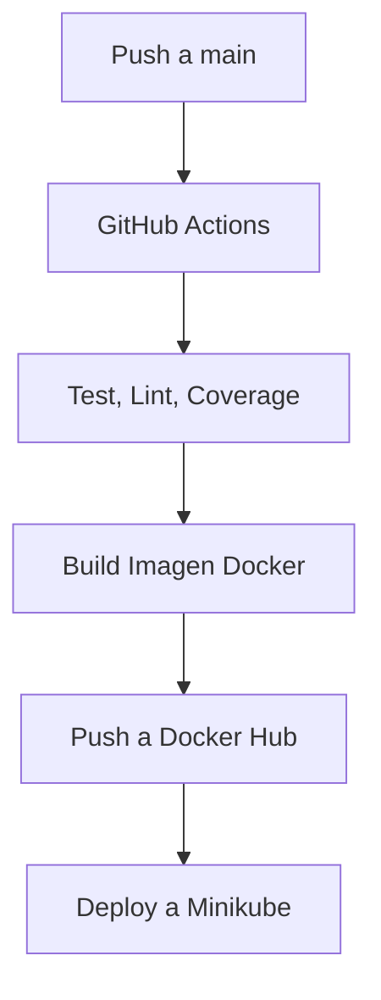

# DevOps Django Demo 🚀

Este proyecto es una aplicación Django con Docker, CI/CD y despliegue en Kubernetes (Minikube).

---

## 📦 Estructura del Proyecto

```
.
├── api/                      # App Django principal
├── demo/                     # Configuración del proyecto Django
├── Dockerfile                # Imagen Docker
├── docker-compose.yml        # Docker Compose para desarrollo local
├── k8s/                      # Manifiestos de Kubernetes
│   ├── deployment.yaml
│   ├── service.yaml
│   └── hpa.yaml (opcional)
├── .github/workflows/        # Workflows de GitHub Actions
│   └── pipeline.yml
├── requirements.txt
├── requirements-dev.txt
└── README.md
```

---

## 🔁 Diagrama CI/CD (Mermaid)



---

## ⚙️ Comandos Útiles

### Docker
```bash
docker build -t hack4u2/devsu-demo-devops-python:latest .
docker push hack4u2/devsu-demo-devops-python:latest
```

### Tests
```bash
python manage.py test
flake8 .
coverage run manage.py test && coverage report
```

### Minikube
```bash
minikube start --driver=docker
minikube addons enable metrics-server
kubectl apply -f k8s/
minikube service devops-python-svc
```

---

## 🌐 ALLOWED_HOSTS

Asegúrate de configurar correctamente la variable de entorno `ALLOWED_HOSTS` para evitar errores tipo `DisallowedHost`. Ejemplo:

```yaml
env:
  - name: ALLOWED_HOSTS
    value: "localhost,127.0.0.1,0.0.0.0,192.168.49.2,devops.internal"
```

---

## ✨ Autor

Desarrollado por **Willmer Drullard** 🛡️
